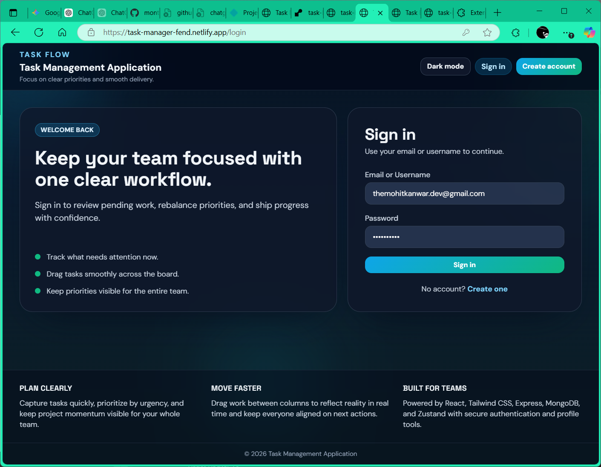
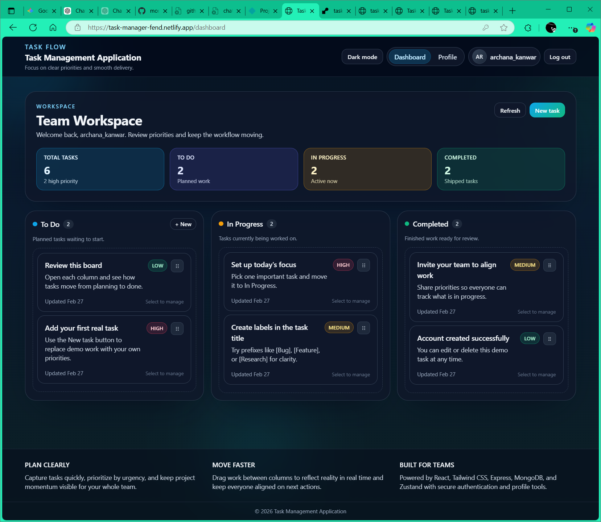
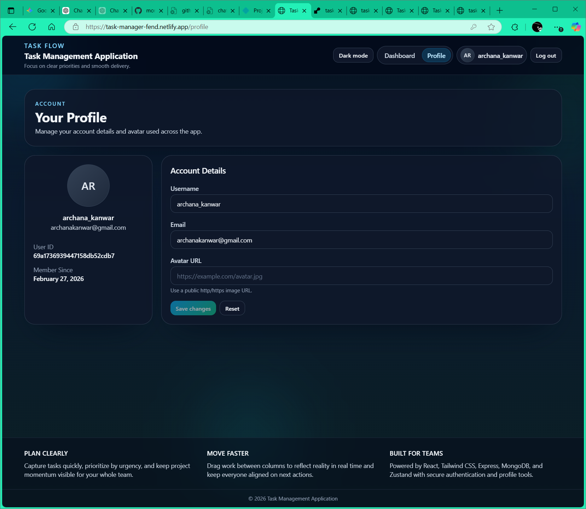

# Task Management Application

A full-stack task management platform built with the MERN ecosystem. It provides secure JWT-based authentication, a responsive Kanban-style workflow, drag-and-drop task reordering, profile management, and deployment-ready backend configuration.

## Live Links

- [Live Frontend App](https://task-manager-fend.netlify.app/ "Open live frontend in browser")
- [Live Backend API](https://task-board-backend-z656.onrender.com "Open live backend API in browser")
- [Live API Health Check](https://task-board-backend-z656.onrender.com/api/health "Open backend health endpoint in browser")


## Project Description

This repository is organized as a monorepo with:

- `backend/`: Node.js + Express REST API with MongoDB
- `frontend/`: React + Vite single-page application

The application helps users plan, track, and complete work across three core task states: **To Do**, **In Progress**, and **Completed**.

## Tech Stack Used

### Frontend

- React 18
- Vite 5
- Tailwind CSS 3 + PostCSS
- Zustand (state management)
- React Router v6
- Axios
- `@dnd-kit` (drag-and-drop)

### Backend

- Node.js 22.x
- Express 4
- MongoDB + Mongoose
- JWT (`jsonwebtoken`) for authentication
- `bcrypt` for password hashing
- `helmet` for security headers
- `express-rate-limit` for API protection
- `cors` for origin control
- `morgan` for logging

### Deployment / Infra

- Docker (backend Dockerfile)
- Docker Compose (backend service)
- Render Blueprint (`render.yaml`)

## Features

- User registration and login (JWT auth)
- Protected routes and token-based session handling
- Task CRUD operations (create/read/update/delete)
- Drag-and-drop task movement and ordering persistence
- Bulk reorder API for smooth DnD persistence
- Priority levels (`low`, `medium`, `high`)
- Task status workflow (`to-do`, `in-progress`, `completed`)
- Task due dates (`dueDate`) with overdue visual highlighting
- Dashboard overdue-only filter for focused backlog triage
- User profile management (username, email, avatar URL)
- Automatic starter task seeding on new user registration
- Theme switching (`light`, `dark`, `system`)
- Health endpoint with database connection status
- Secure defaults: Helmet, CORS allowlist, rate limiting

## Installation Instructions

### Prerequisites

- Node.js `22.x` (backend engine target)
- npm
- MongoDB (local instance or cloud connection string)

### 1. Clone the repository

```bash
git clone <your-repository-url>
cd task-management-application
```

### 2. Setup and run backend

```bash
cd backend
copy .env.example .env
# macOS/Linux: cp .env.example .env
npm install
npm run dev
```

Backend runs on `http://localhost:5000` by default.

### 3. Setup and run frontend

```bash
cd ../frontend
copy .env.example .env
# macOS/Linux: cp .env.example .env
npm install
npm run dev
```

Frontend runs on `http://localhost:5173` by default.

## Environment Variables

### Backend (`backend/.env`)

| Variable | Required | Example | Notes |
| --- | --- | --- | --- |
| `PORT` | No | `5000` | API port (defaults to `5000`) |
| `MONGO_URI` | Yes | `mongodb://localhost:27017/task_board` | MongoDB connection string |
| `JWT_SECRET` | Yes | `replace-with-a-long-random-string` | Used to sign auth tokens |
| `CLIENT_URL` | Yes | `http://localhost:5173` | Allowed CORS origins; supports comma-separated values |
| `NODE_ENV` | No | `development` | `production` recommended in deployed environments |

### Frontend (`frontend/.env`)

| Variable | Required | Example | Notes |
| --- | --- | --- | --- |
| `VITE_API_URL` | Yes | `http://localhost:5000` | Backend base URL. Use root API origin (do not append `/api`). |

## Available Scripts

### Backend (`backend/package.json`)

```bash
npm run dev      # Start backend with nodemon
npm start        # Start backend with node
npm run lint     # Run ESLint (flat config in backend/eslint.config.js)
```

### Frontend (`frontend/package.json`)

```bash
npm run dev      # Start Vite dev server
npm run build    # Production build
npm run preview  # Preview production build locally
```

## CI/CD

- GitHub Actions workflow: `.github/workflows/ci.yml`
- Triggers: push and pull request events targeting `develop` and `main`
- Pipeline stages:
  - install backend dependencies
  - install frontend dependencies
  - lint backend
  - run backend/frontend tests when scripts are present
  - build frontend

## Project Structure Overview

```text
task-management-application/
|-- backend/
|   |-- src/
|   |   |-- config/          # env validation, DB connection
|   |   |-- controllers/     # auth/task/board handlers
|   |   |-- middleware/      # auth + error middleware
|   |   |-- models/          # mongoose schemas
|   |   |-- routes/          # API route modules
|   |   |-- services/        # starter task seeding
|   |   |-- utils/           # JWT helper
|   |   |-- public/          # backend landing page
|   |   |-- app.js           # express app setup
|   |   |-- server.js        # server bootstrap
|   |-- docs/
|   |   |-- postman_collection.json
|   |-- Dockerfile
|   |-- .env.example
|   |-- package.json
|-- frontend/
|   |-- src/
|   |   |-- components/
|   |   |-- pages/
|   |   |-- stores/          # Zustand stores
|   |   |-- lib/             # axios API client
|   |   |-- App.jsx
|   |   |-- main.jsx
|   |-- .env.example
|   |-- package.json
|   |-- vite.config.js
|-- docker-compose.yml
|-- render.yaml
|-- ARCHITECTURE.md
|-- DRAG_AND_DROP_UX_REPORT.md
|-- README.md
```

## Usage Instructions

1. Register a new account from `/register`.
2. Sign in from `/login`.
3. Open `/dashboard` to view your task board.
4. Create tasks using **New task**.
5. Click a task to reveal **Edit** and **Delete** actions.
6. Set task due dates from the task form (`Due Date` input).
7. Use **Show Overdue Only** on dashboard to filter overdue items.
8. Drag and drop tasks within or across columns to reorder and change status (disabled while overdue-only filter is active).
9. Open `/profile` to update username, email, and avatar URL.
10. Use the theme toggle in the header to switch between `light`, `dark`, and `system`.

## API Endpoints

Base URL (local): `http://localhost:5000`

### Health

| Method | Endpoint | Auth | Description |
| --- | --- | --- | --- |
| `GET` | `/api/health` | No | Service + DB readiness status |

### Auth

| Method | Endpoint | Auth | Description |
| --- | --- | --- | --- |
| `POST` | `/api/auth/register` | No | Register user (`username`, `email`, `password`, optional `avatarUrl`) |
| `POST` | `/api/auth/login` | No | Login with `identifier` (email or username) + `password` |
| `GET` | `/api/auth/profile` | Yes | Get current user profile |
| `PUT` | `/api/auth/profile` | Yes | Update profile (`username`, `email`, `avatarUrl`) |

### Tasks

| Method | Endpoint | Auth | Description |
| --- | --- | --- | --- |
| `POST` | `/api/tasks` | Yes | Create task (`title`, optional `description`, `priority`, `status`, `dueDate`) |
| `GET` | `/api/tasks` | Yes | List current user tasks |
| `PUT` | `/api/tasks/:id` | Yes | Update task fields (including nullable `dueDate`) |
| `DELETE` | `/api/tasks/:id` | Yes | Delete task |
| `PUT` | `/api/tasks/reorder/bulk` | Yes | Bulk update task `status` and `position` |

### Boards

| Method | Endpoint | Auth | Description |
| --- | --- | --- | --- |
| `POST` | `/api/boards` | Yes | Create board |
| `GET` | `/api/boards/:id` | Yes | Get board by id |
| `PUT` | `/api/boards/:id` | Yes | Update board |
| `DELETE` | `/api/boards/:id` | Yes | Delete board |

Note: An API collection is available at `backend/docs/postman_collection.json`.

## Deployment Instructions

### Option 1: Render (Backend)

The repository includes `render.yaml` for backend deployment.

1. Connect the repository in Render.
2. Render will detect the Docker web service in `backend/`.
3. Set environment variables:
- `NODE_ENV=production`
- `MONGO_URI`
- `JWT_SECRET`
- `CLIENT_URL` (your deployed frontend URL)
4. Use `/api/health` as the health check endpoint.

### Option 2: Frontend Deployment (Vercel/Netlify)

Deploy `frontend/` as a static app:

- Build command: `npm run build`
- Output directory: `dist`
- Required env: `VITE_API_URL=<your-backend-origin>`
- After deployment, update the **Live Links** section at the top of this README with your production URLs.

### Option 3: Docker Compose (Local Backend Container)

```bash
docker compose up --build
```

Current `docker-compose.yml` provisions the backend service.

## Screenshots

### Login Page



### Dashboard



### Profile Page



## Contribution Guidelines

### Branching Strategy

- `main`: Stable production-ready code
- `develop`: Active integration branch
- `feature/<feature-name>`: New feature work
- `fix/<bug-name>`: Bug fixes
- `docs/<topic>`: Documentation updates
- `chore/<task>`: Maintenance/infrastructure housekeeping
- `ci/<task>`: CI/CD pipeline changes

Never work directly on `main` or `master`.

### Contribution Workflow

1. Fork or clone the repository.
2. Create a branch from `develop` using the naming strategy above.
3. Commit changes with clear messages.
4. Push your branch and open a Pull Request into `develop`.

Example:

```bash
git checkout -b feature/<branch-name>
git add .
git commit -m "feat: <short description>"
git push origin feature/<branch-name>
```

## Additional Documentation

- `ARCHITECTURE.md` for system-level architecture notes
- `DRAG_AND_DROP_UX_REPORT.md` for DnD UI/UX implementation details
- `docs/releases/RELEASE_NOTES.md` for consolidated release notes across all tagged versions

## License

No license file is currently included in this repository. Add a `LICENSE` file to define usage terms.
